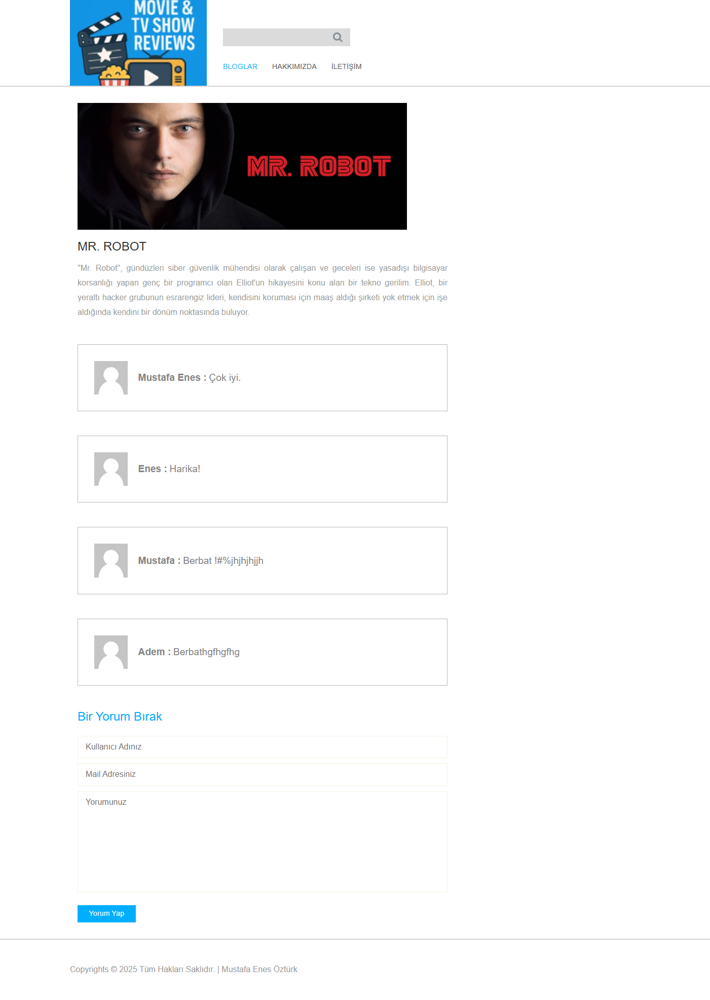
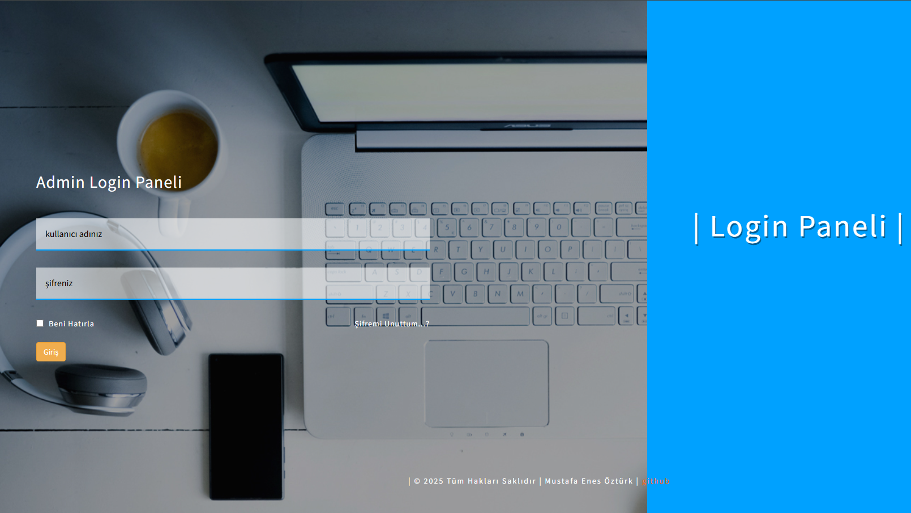
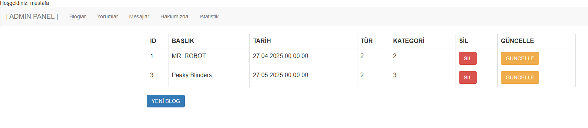

# DiziYorumProje

Bu proje, dizi ve film yorumları için geliştirilmiş bir web uygulamasıdır. Kullanıcılar diziler hakkında yorumlar yapabilir ve görüşlerini paylaşabilirler.

## Teknolojiler

- ASP.NET MVC
- MS SQL Server
- Entity Framework
- Bootstrap

## Kurulum

1. Projeyi klonlayın
2. SQL Server'da `BlogDizi.bak` dosyasını restore edin
3. Visual Studio'da projeyi açın
4. Web.config dosyasındaki connection string'i kendi veritabanı bağlantınıza göre güncelleyin
5. Projeyi çalıştırın

## Ekran Görüntüleri

 